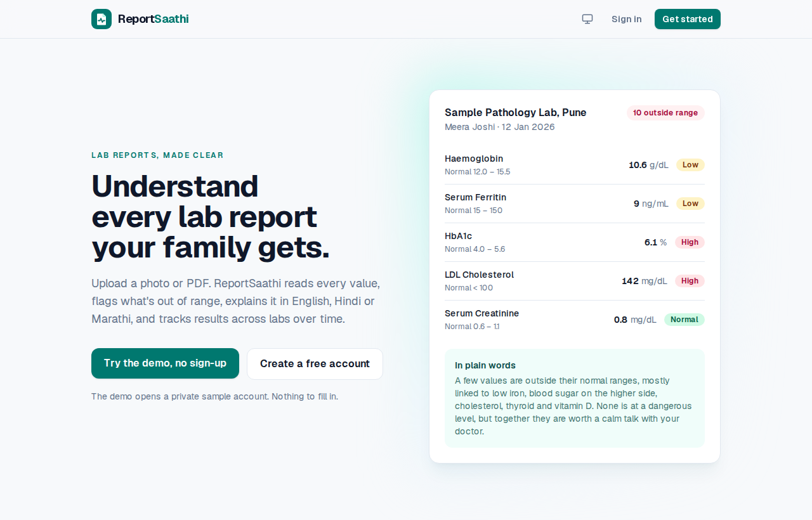
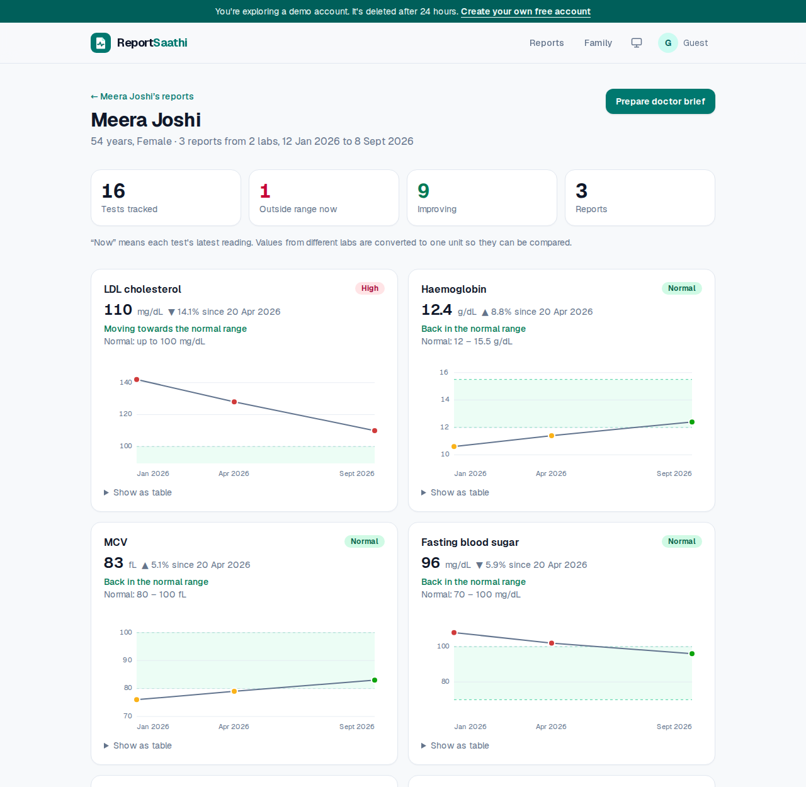
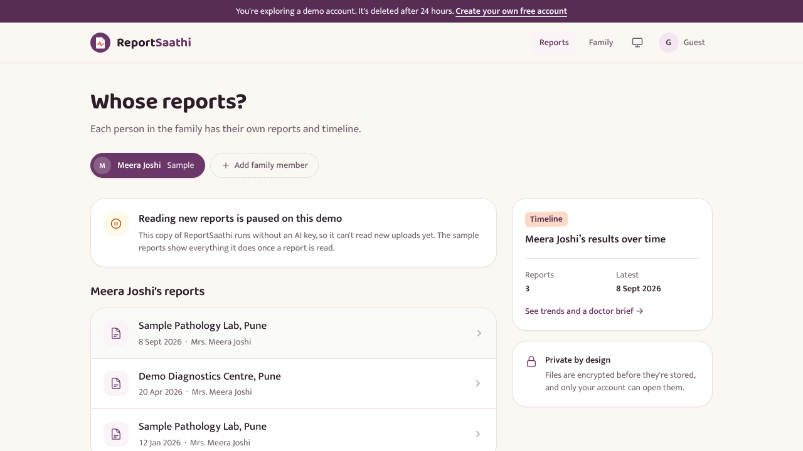
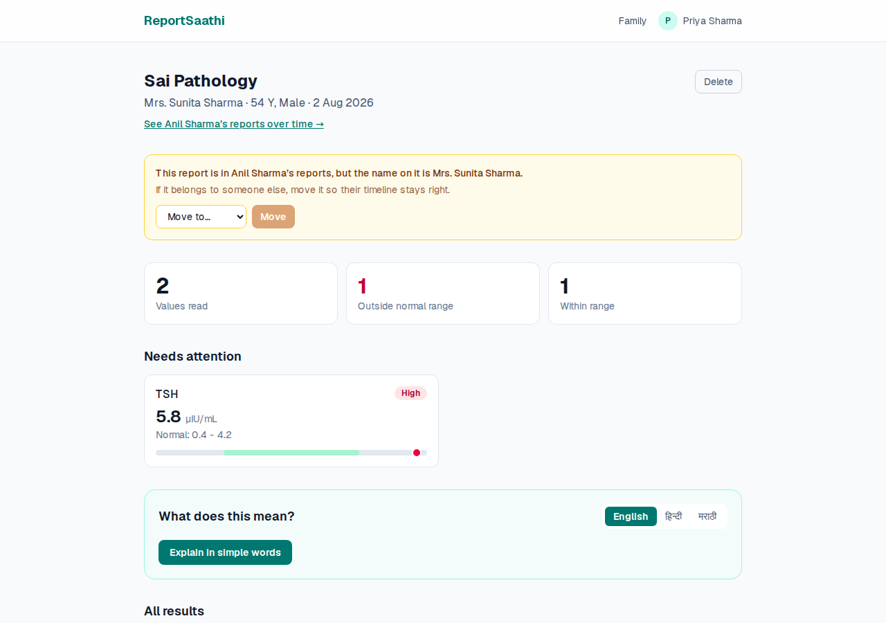
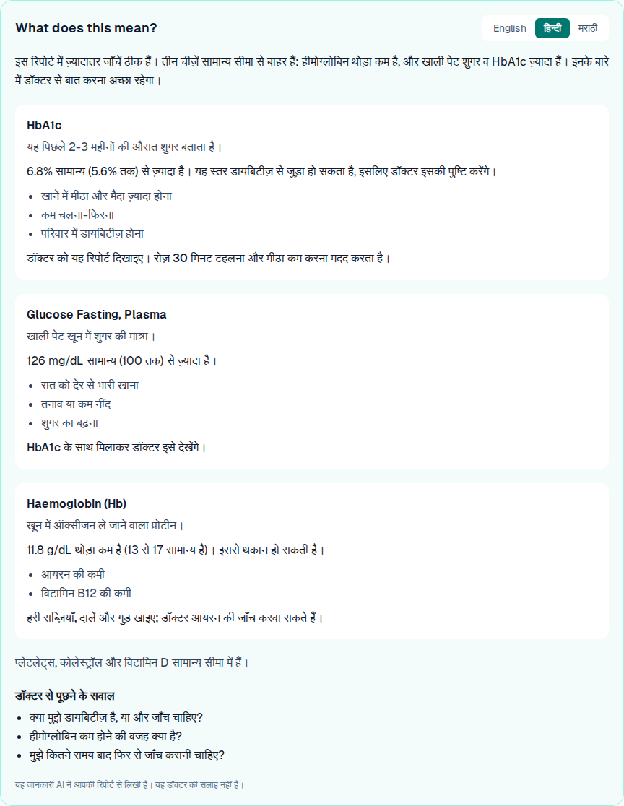
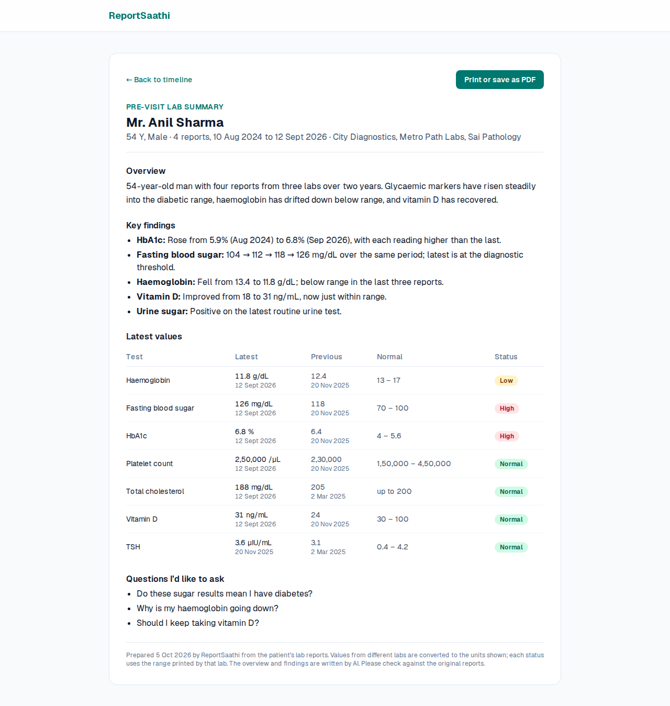
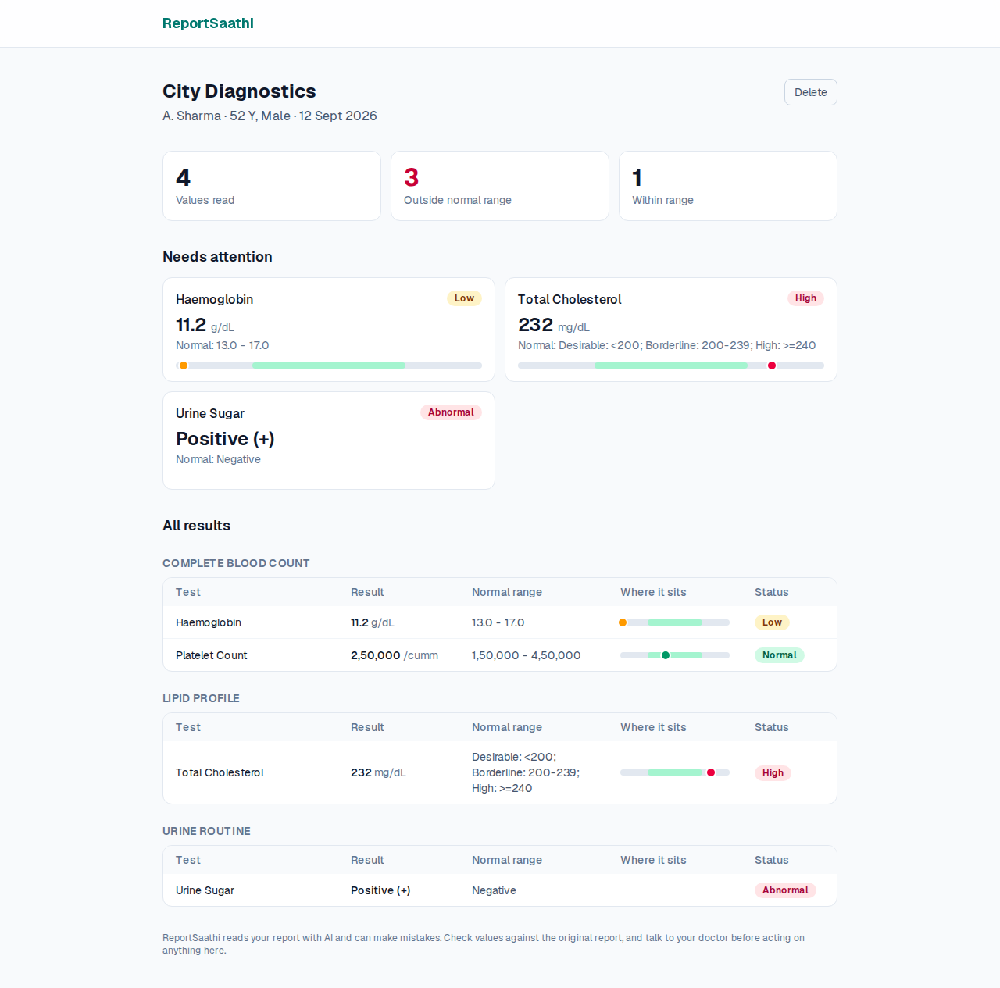
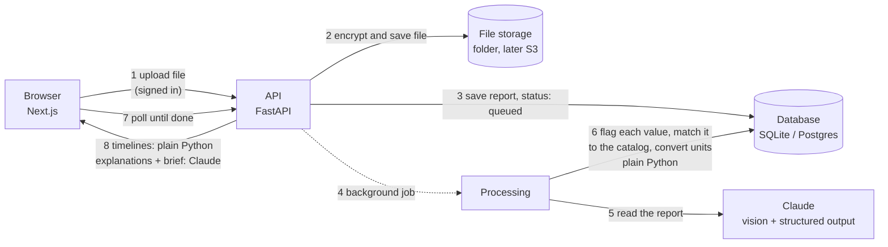

# ReportSaathi

Upload lab reports from any Indian lab, as PDFs or phone photos. ReportSaathi reads every value,
flags the ones outside the normal range, explains them in plain English, Hindi or Marathi, and lines
up reports from different labs into one health timeline you can hand to your doctor. One account
keeps the whole family's reports, privately and encrypted.

**Live demo:** https://report-saathi-six.vercel.app (click "Try the demo", no sign-up needed)





> Screenshots use sample data.

## What works today

### Phase 5: beating the competition on trust

- **Fix a misread value.** A pencil beside every value opens a small form; the fixed value is flagged
  again by the same plain-Python code, so the badge, the range bar, "needs attention" and the timeline
  all follow it. A "Corrected" chip shows what the AI had read. Works on the sample reports too.
- Every fix is logged, and `python -m accuracy.run corrections` exports them as test cases for the
  accuracy kit (test name, value read, value corrected, units; nothing personal).
- **Where did this number come from?** A page icon beside each value opens the original report with
  that value highlighted and zoomed into view ("Read from page 1 of the original"); for a PDF it opens
  the right page in a new tab. "View original" in the report header shows the whole file. The AI now
  returns where it read each value; Meera's sample reports are drawn as clearly marked sample pages
  (`backend/scripts/make_sample_images.py`), so the demo shows this too.
- **Send the doctor a link.** Under the doctor brief, "Share with your doctor" makes a private link
  (copy it, or send it straight to WhatsApp from a phone). The doctor reads the brief without an
  account on a plain read-only page they can print. Links stop after 7 days (sooner on a demo
  account) or when revoked, and the list shows "opened 2 times, last on 6 Oct 2026" for each.
- Only a hash of each link's token is stored, unknown, expired and revoked links all get the same
  "not available" answer, opening is rate-limited per address, and the brief is sent with `no-store`
  and `no-referrer` so it isn't cached or leaked onward. Works on Meera's sample brief in the demo.
- **Your data, your rights (India's DPDP Act 2023).** "Download all my data" on the Account page gives
  one ZIP: every original report (decrypted, in a folder per person, named by date), a CSV of every
  value for Excel, and a JSON file with everything else, including fixes, explanations and briefs.
  Try it on the demo account. A plain-language [privacy page](frontend/src/app/privacy/page.tsx)
  (`/privacy`) says what is kept, where, by whom, for how long, and how to use each right in the app.
- Before a person's first upload, a short notice asks them to agree (what is stored, encrypted files,
  Claude reads the reports and doesn't train on them, download or delete any time). The server
  records which version they agreed to and when, and refuses uploads until they do.
- **Share straight from WhatsApp.** The site is an installable app (web app manifest, app icons and a
  small service worker). Once added to an Android home screen, ReportSaathi appears in WhatsApp's
  "Share to" menu: the PDF or photo opens on a page that shows its name and size and asks whose report
  it is, then uploads it. Signed out, it waits on the phone through sign-in. In the demo it shows the
  same "reading is paused" note as the home page.
- **Listen in English, Hindi or Marathi.** A Listen button on each explanation reads the summary, every
  flagged test and the questions for the doctor aloud with the phone's own voices (free, nothing sent
  anywhere). It only appears when the device has a voice for that language. Try it on Meera's reports.
- **A bigger test catalog with international codes.** 229 tests (up from 51): absolute blood counts,
  the full urine routine (colour, bile pigments, nitrite, casts, crystals), 24-hour urine tests, iron
  studies, kidney ratios, electrolytes, hormones, cardiac markers, clotting controls and more. 216 of them
  carry their LOINC code (the international ID for a lab test), shown small under each test name in the
  doctor brief, and included in the report API and in "Download all my data". Every code passes LOINC's
  check digit, and a test makes sure no spelling can match two tests.
- **Typical ranges, clearly labelled.** When a report prints no normal range, a catalogued value is
  compared with a typical adult range for the person's sex, marked "Typical range, not from your lab"
  with its source. A range the lab printed is never replaced, with the sex unknown only a range for
  anyone is used, and children get none (every range is an adult one). Meera's April report shows one (her lab left the creatinine range off).
- **Due for a recheck.** The timeline lists tests whose latest reading was out of range longer ago than
  doctors often wait to recheck them: "Your HbA1c was high on 12 Jan 2026. Doctors often recheck it
  after about 3 months. Ask your doctor whether it's time." Each interval names its guideline (ADA,
  KDIGO, NICE and others). Meera's LDL becomes due on 8 Dec 2026.

### Phase 4: production polish

- A public landing page, and **Try the demo**: one click opens a private guest account with the
  sample reports in it. Guest accounts and their files are deleted after 24 hours.
- One design system across every page, a light/dark/system theme switch, loading skeletons,
  friendly 404 and error pages, a logo, and a share image for WhatsApp and LinkedIn previews.
- Trend charts always show the normal range, say whether each test is moving towards or away from
  it, and show a reading on tap on phones.
- When the free API is asleep, the site says "waking up the server" and retries reads instead of
  failing; a scheduled GitHub Action pings it every 10 minutes so it rarely sleeps.
- Rate limits on sign-in and demo creation, a cap on how many reports guests and accounts can have
  read (which caps the AI bill), and optional Sentry error tracking (`RS_SENTRY_DSN`).
- Browser tests (Playwright) drive the real site and API on a desktop and a phone screen in CI.

### Phase 3: accounts, family profiles, encryption, accuracy test

- **Sign up and sign in.** Passwords are hashed with Argon2id; sessions live in HttpOnly cookies and
  only their hashes are stored; five wrong passwords lock the account for 15 minutes.
- **Family profiles.** Add parents, children and others, and file each report under the right person.
  If the name on a report doesn't match the profile, the app warns you and lets you move it.
- **Private by design.** Every request checks ownership; another account's data answers "not found".
  Deleting a report, a person, or your whole account deletes the files too.
- **Encrypted files.** Every upload is encrypted with its own key (AES-256-GCM, envelope encryption,
  ready for AWS KMS) before it touches the disk.
- **Accuracy test kit.** Measures how many values are found, invented, and read and flagged correctly
  on real reports against hand-checked answers. See [docs/ACCURACY.md](docs/ACCURACY.md).

| Whose report is it? | Name on report doesn't match |
|---|---|
|  |  |

### Phase 2: trends, explanations, doctor brief

- **One timeline across labs.** "Hb 13.4 g/dL", "HGB 128 g/L" and "Hemoglobin 12.4 gm%" from three
  labs are recognised as the same test and converted to one unit. A catalog of common tests (229 now)
  handles the spellings and units Indian labs use (lakhs/cumm, gm%, mmol/L and more).
- **Trend charts** for every test seen more than once: the normal range as a band, each reading
  coloured and labelled low/high/normal, hover for what the lab actually printed, and a table view.
- **Plain-language explanations** of any report in English, हिन्दी or मराठी: what each flagged value
  measures, what it can point to, common reasons, what to do next, and questions for the doctor.
- **Doctor brief:** a one-page, printable summary of everything on file, with a table of latest and
  previous values computed by code, and an AI-written overview of what changed.

| Explanation in Hindi | Doctor brief |
|---|---|
|  |  |

### Phase 1: read a report and flag values



- Upload a PDF, JPG, PNG or WEBP report (up to 20 MB). Large phone photos are shrunk automatically.
- Claude reads every page and returns each test as structured data: name, value, unit, printed range.
- Plain Python code, not the AI, decides whether each value is low, high or normal.
- Results page: a "needs attention" summary, every value grouped by panel, and a bar showing where
  each value sits against its range. Works on phones.
- Every report can be deleted, together with its file.

Coming next: the accuracy run on 50 real reports, then deployment on AWS (Amplify, App Runner, SQS,
S3, RDS and KMS).

## How it works



The full walkthrough, written for someone new to these tools, is in
[docs/ARCHITECTURE.md](docs/ARCHITECTURE.md). Why each technology was picked is in
[docs/DECISIONS.md](docs/DECISIONS.md).

## Run it locally

You need Python 3.11+, Node 22+, and an Anthropic API key from
[console.anthropic.com](https://console.anthropic.com).

**Backend** (terminal 1):

```bash
cd backend
python -m venv .venv && source .venv/bin/activate   # Windows: .venv\Scripts\activate
pip install -r requirements-dev.txt
cp .env.example .env          # then paste your API key into .env
alembic upgrade head          # creates the database tables
uvicorn app.main:app --reload # API on http://localhost:8000, docs at /docs
```

**Frontend** (terminal 2):

```bash
cd frontend
npm install
cp .env.example .env.local
npm run dev                   # website on http://localhost:3000, then create an account
```

In development an encryption key for uploaded files is created in `backend/.dev-master-key`. Keep it:
without it, saved files can't be opened. In production set `RS_MASTER_KEY` and `RS_ENV=production`
(see `backend/.env.example`).

**Or everything with Docker** (also starts Postgres):

```bash
cp backend/.env.example backend/.env   # add your key
docker compose up --build
```

## Demo mode

With no Anthropic key, the app still runs: uploads are paused, and visitors can open the one-click demo
or add **sample reports**
(Meera, a made-up person with three reports from two labs). They go through the same flagging, unit
conversion and trend code as real uploads, with explanations in three languages and a doctor brief
written in advance. Add `ANTHROPIC_API_KEY` and uploads switch on.

## Deploying

[docs/DEPLOY.md](docs/DEPLOY.md) covers every setting, plus two routes: Render + Vercel + Neon on free tiers, or AWS
(Amplify, App Runner, RDS, S3, KMS).

## Tests

```bash
cd backend && pytest        # 318 tests: flags, units, trends, sign-in, privacy, encryption, demo accounts, limits, fixes, share links, data export, consent
cd frontend && npm run lint && npm run build
cd frontend && npx playwright test   # 27 browser tests, 53 runs on a computer and a phone (one is phone-only); starts the API and the site itself
```

The tests never call the real Claude API; they use a stand-in for Claude, so they are free and fast.
GitHub Actions runs all of this on every push, plus the database migrations against real Postgres.

## Project layout

```
backend/
  app/
    main.py               FastAPI app, health check
    api/auth.py           sign up, sign in, sign out, consent, download all my data, delete account
    api/profiles.py       family profiles, timelines, doctor briefs
    api/reports.py        upload, list, get, move, delete, explanations
    api/shares.py         doctor share links: make, list, revoke, and the public read-only view
    api/deps.py           ownership checks every endpoint uses
    services/
      uploads.py          checks file type by its bytes, shrinks big photos
      extraction.py       sends the report to Claude, gets structured data back
      flagging.py         parses reference ranges, decides low / high / normal
      corrections.py      saves a value the person fixed, re-flags it, logs the fix
      catalog.py          229 tests: spellings, units, LOINC codes, typical ranges, recheck intervals
      auth.py             password hashing, sessions, lockout
      sharing.py          share-link tokens, expiry, and the opening log
      export.py           "download all my data": the ZIP of files, JSON and CSV
      consent.py          the data notice version people agree to before uploading
      crypto.py           envelope encryption for uploaded files
      names.py            spots a report filed under the wrong person
      trends.py           builds each person's timeline (all numbers, no AI)
      writing.py          Claude writes explanations and the doctor brief
      claude.py           the one place that calls Claude
      processing.py       the background job that reads a report
      jobs.py             background jobs for explanations and briefs
      storage.py          where files live (local folder now, S3 later), encrypted
    models.py             database tables
    schemas.py            JSON shapes the API returns
  alembic/                database migrations
  accuracy/               the accuracy test on real reports
  tests/
frontend/
  src/app/                pages: home, sign in, family, account, accuracy, privacy, reports, timelines, briefs, shared briefs
  src/components/         upload, results, trend chart, explanation panel, doctor brief, forms
  src/proxy.ts            sends signed-out visitors to the sign-in page
  src/lib/api.ts          calls to the backend (forwarded to FastAPI by next.config.ts)
```

## Disclaimer

ReportSaathi is a learning project. It can misread a report, and it is not medical advice.
