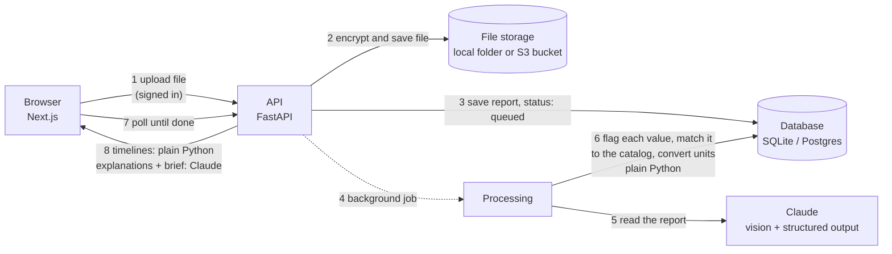

# ReportSaathi

[](https://github.com/whatalshifa/report-saathi/actions/workflows/ci.yml)
[](LICENSE)

**Live demo: [report-saathi-six.vercel.app](https://report-saathi-six.vercel.app)** (opens straight into a sample family, no sign-up needed)

Understand every lab report your family gets. Upload a lab report from any Indian lab, as a PDF or a
phone photo. ReportSaathi reads every value, flags the ones outside the normal range, explains them in
plain English, Hindi or Marathi, and lines up reports from different labs into one timeline you can
hand to your doctor. Every value links back to the exact spot on the report it was read from, so you
can check the AI instead of trusting it.

> The live demo runs without an AI key, so new uploads are paused and the demo shows a made-up
> person's sample reports. Every other feature works on them. The API is on a free plan that sleeps
> when idle, so the first visit can take up to a minute.


| Health timeline across labs | Results with ranges |
|---|---|
|  |  |
| **Explanation in Hindi** | **Doctor brief** |
|  |  |

## What it does

- **Reads any lab report.** Claude reads every page and returns each test as structured data. Plain
  Python, not the AI, decides whether a value is low, high or normal.
- **Shows where every number came from.** One tap opens the original report with that value
  highlighted. A misread value can be fixed, and every fix is logged for the accuracy test.
- **One timeline across labs.** "Hb 13.4 g/dL", "HGB 128 g/L" and "Hemoglobin 12.4 gm%" are
  recognised as the same test, using a catalog of 229 tests with LOINC codes, and drawn as trend
  charts against the normal range.
- **Explanations in three languages,** read aloud on request, and a one-page **doctor brief** that
  can be shared as a private, expiring link or QR code.
- **The whole family, privately.** One account holds profiles for parents and children. Files are
  encrypted with their own keys (AES-256-GCM envelope encryption), and people can download or delete
  all their data, as India's DPDP Act requires.

The full feature list, phase by phase, is in [docs/FEATURES.md](docs/FEATURES.md).

## Built with

- **Website:** Next.js 16, React 19, TypeScript, Tailwind CSS 4. Hosted on Vercel.
- **API:** Python 3.11, FastAPI, SQLAlchemy, Alembic, pdfplumber. Hosted on Render.
- **AI:** Claude through the Anthropic API (vision, structured outputs).
- **Data:** Postgres and an S3-compatible bucket on Neon.
- **Quality:** pytest, Playwright (desktop and phone), GitHub Actions, optional Sentry.

## How it works



The full walkthrough, written for someone new to these tools, is in
[docs/ARCHITECTURE.md](docs/ARCHITECTURE.md). Why each technology was picked is in
[docs/DECISIONS.md](docs/DECISIONS.md).

## Run it locally

You need Python 3.11+, Node 22+, and an Anthropic API key from
[console.anthropic.com](https://console.anthropic.com).

**Backend** (terminal 1):

```bash
cd backend
python -m venv .venv && source .venv/bin/activate   # Windows: .venv\Scripts\activate
pip install -r requirements-dev.txt
cp .env.example .env          # then paste your API key into .env
alembic upgrade head          # creates the database tables
uvicorn app.main:app --reload # API on http://localhost:8000, docs at /docs
```

**Frontend** (terminal 2):

```bash
cd frontend
npm install
cp .env.example .env.local
npm run dev                   # website on http://localhost:3000, then create an account
```

In development an encryption key for uploaded files is created in `backend/.dev-master-key`. Keep it:
without it, saved files can't be opened. In production set `RS_MASTER_KEY` and `RS_ENV=production`
(see `backend/.env.example`).

**Or everything with Docker** (also starts Postgres):

```bash
cp backend/.env.example backend/.env   # add your key
docker compose up --build
```

## Demo mode

With no Anthropic key, the app still runs: uploads are paused, and visitors can open the one-click demo
or add **sample reports**
(Meera, a made-up person with three reports from two labs). They go through the same flagging, unit
conversion and trend code as real uploads, with explanations in three languages and a doctor brief
written in advance. Add `ANTHROPIC_API_KEY` and uploads switch on.

## Deploying

[docs/DEPLOY.md](docs/DEPLOY.md) covers every setting, plus two routes: Render + Vercel + Neon on free tiers, or AWS
(Amplify, App Runner, RDS, S3, KMS).

## Tests

```bash
cd backend && pytest        # 336 tests: flags, units, trends, sign-in, privacy, encryption, demo accounts, limits, fixes, share links, data export, consent, QR codes, PDF boxes
cd frontend && npm run lint && npm run build
cd frontend && npx playwright test   # 32 browser tests, 63 runs on a computer and a phone (one is phone-only); starts the API and the site itself
```

The tests never call the real Claude API; they use a stand-in for Claude, so they are free and fast.
GitHub Actions runs all of this on every push, plus the database migrations against real Postgres.

## Project layout

```
backend/
  app/
    main.py               FastAPI app, health check
    api/auth.py           sign up, sign in, sign out, consent, download all my data, delete account
    api/profiles.py       family profiles, timelines, doctor briefs
    api/reports.py        upload, list, get, move, delete, explanations
    api/shares.py         doctor share links: make, list, revoke, and the public read-only view
    api/deps.py           ownership checks every endpoint uses
    services/
      uploads.py          checks file type by its bytes, shrinks big photos
      extraction.py       sends the report to Claude, gets structured data back
      pdf_text.py         exact value boxes from a PDF's own text, and PDF pages drawn as images
      flagging.py         parses reference ranges, decides low / high / normal
      corrections.py      saves a value the person fixed, re-flags it, logs the fix
      catalog.py          229 tests: spellings, units, LOINC codes, typical ranges, recheck intervals
      auth.py             password hashing, sessions, lockout
      sharing.py          share-link tokens, expiry, the opening log, and QR codes
      export.py           "download all my data": the ZIP of files, JSON and CSV
      consent.py          the data notice version people agree to before uploading
      crypto.py           envelope encryption for uploaded files
      names.py            spots a report filed under the wrong person
      trends.py           builds each person's timeline (all numbers, no AI)
      writing.py          Claude writes explanations and the doctor brief
      claude.py           the one place that calls Claude
      processing.py       the background job that reads a report
      jobs.py             background jobs for explanations and briefs
      storage.py          where files live (local folder now, S3 later), encrypted
    models.py             database tables
    schemas.py            JSON shapes the API returns
  alembic/                database migrations
  accuracy/               the accuracy test on real reports
  tests/
frontend/
  src/app/                pages: home, sign in, family, account, accuracy, privacy, reports, timelines, briefs, shared briefs
  src/components/         upload, results, trend chart, explanation panel, doctor brief, forms
  src/proxy.ts            sends signed-out visitors to the sign-in page
  src/lib/api.ts          calls to the backend (forwarded to FastAPI by next.config.ts)
```

## Disclaimer

ReportSaathi is a learning project. It can misread a report, and it is not medical advice.
