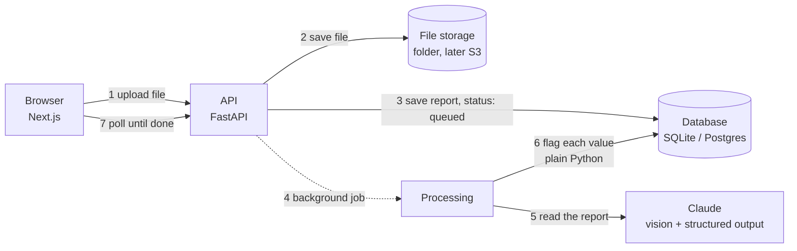

# ReportSaathi

Upload a lab report from any Indian lab, as a PDF or a phone photo. ReportSaathi reads every value
on it and shows which ones are outside the normal range.


> Screenshot uses sample data.

## What works today (Phase 1)

- Upload a PDF, JPG, PNG or WEBP report (up to 20 MB). Large phone photos are shrunk automatically.
- Claude reads every page and returns each test as structured data: name, value, unit, printed range.
- Plain Python code, not the AI, decides whether each value is low, high or normal.
- Results page: a "needs attention" summary, every value grouped by panel, and a bar showing where
  each value sits against its range. Works on phones.
- Every report can be deleted, together with its file.

Coming next: trends across reports and labs, plain-language explanations in Hindi, English and
Marathi, and a doctor brief (Phase 2); login, family profiles and encrypted storage (Phase 3);
deployment on AWS.

## How it works



The full walkthrough, written for someone new to these tools, is in
[docs/ARCHITECTURE.md](docs/ARCHITECTURE.md). Why each technology was picked is in
[docs/DECISIONS.md](docs/DECISIONS.md).

## Run it locally

You need Python 3.11+, Node 22+, and an Anthropic API key from
[console.anthropic.com](https://console.anthropic.com).

**Backend** (terminal 1):

```bash
cd backend
python -m venv .venv && source .venv/bin/activate   # Windows: .venv\Scripts\activate
pip install -r requirements-dev.txt
cp .env.example .env          # then paste your API key into .env
alembic upgrade head          # creates the database tables
uvicorn app.main:app --reload # API on http://localhost:8000, docs at /docs
```

**Frontend** (terminal 2):

```bash
cd frontend
npm install
cp .env.example .env.local
npm run dev                   # website on http://localhost:3000
```

**Or everything with Docker** (also starts Postgres):

```bash
cp backend/.env.example backend/.env   # add your key
docker compose up --build
```

## Tests

```bash
cd backend && pytest        # 53 tests: range parsing, flagging, the API, the Claude request
cd frontend && npm run lint && npm run build
```

The tests never call the real Claude API; they use a fake extractor, so they are free and fast.
GitHub Actions runs all of this on every push, plus the database migrations against real Postgres.

## Project layout

```
backend/
  app/
    main.py               FastAPI app, CORS, health check
    api/reports.py        upload, list, get, delete endpoints
    services/
      uploads.py          checks file type by its bytes, shrinks big photos
      extraction.py       sends the report to Claude, gets structured data back
      flagging.py         parses reference ranges, decides low / high / normal
      processing.py       the background job that ties it together
      storage.py          where files live (local folder now, S3 later)
    models.py             database tables
    schemas.py            JSON shapes the API returns
  alembic/                database migrations
  tests/
frontend/
  src/app/                pages: home, /reports/[id]
  src/components/         upload card, report list, results view, range bar
  src/lib/api.ts          calls to the backend
```

## Disclaimer

ReportSaathi is a learning project. It can misread a report, and it is not medical advice.
