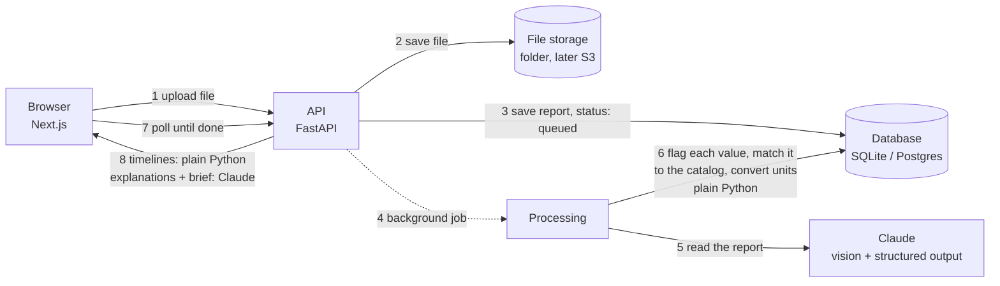

# ReportSaathi

Upload lab reports from any Indian lab, as PDFs or phone photos. ReportSaathi reads every value,
flags the ones outside the normal range, explains them in plain English, Hindi or Marathi, and lines
up reports from different labs into one health timeline you can hand to your doctor.


> Screenshots use sample data.

## What works today

### Phase 2: trends, explanations, doctor brief

- **One timeline across labs.** "Hb 13.4 g/dL", "HGB 128 g/L" and "Hemoglobin 12.4 gm%" from three
  labs are recognised as the same test and converted to one unit. A catalog of 51 common tests
  handles the spellings and units Indian labs use (lakhs/cumm, gm%, mmol/L and more).
- **Trend charts** for every test seen more than once: the normal range as a band, each reading
  coloured and labelled low/high/normal, hover for what the lab actually printed, and a table view.
- **Plain-language explanations** of any report in English, हिन्दी or मराठी: what each flagged value
  measures, what it can point to, common reasons, what to do next, and questions for the doctor.
- **Doctor brief:** a one-page, printable summary of everything on file, with a table of latest and
  previous values computed by code, and an AI-written overview of what changed.

| Explanation in Hindi | Doctor brief |
|---|---|
|  |  |

### Phase 1: read a report and flag values


- Upload a PDF, JPG, PNG or WEBP report (up to 20 MB). Large phone photos are shrunk automatically.
- Claude reads every page and returns each test as structured data: name, value, unit, printed range.
- Plain Python code, not the AI, decides whether each value is low, high or normal.
- Results page: a "needs attention" summary, every value grouped by panel, and a bar showing where
  each value sits against its range. Works on phones.
- Every report can be deleted, together with its file.

Coming next: login, family profiles and encrypted storage, plus an accuracy test on real reports
(Phase 3); then deployment on AWS.

## How it works



The full walkthrough, written for someone new to these tools, is in
[docs/ARCHITECTURE.md](docs/ARCHITECTURE.md). Why each technology was picked is in
[docs/DECISIONS.md](docs/DECISIONS.md).

## Run it locally

You need Python 3.11+, Node 22+, and an Anthropic API key from
[console.anthropic.com](https://console.anthropic.com).

**Backend** (terminal 1):

```bash
cd backend
python -m venv .venv && source .venv/bin/activate   # Windows: .venv\Scripts\activate
pip install -r requirements-dev.txt
cp .env.example .env          # then paste your API key into .env
alembic upgrade head          # creates the database tables
uvicorn app.main:app --reload # API on http://localhost:8000, docs at /docs
```

**Frontend** (terminal 2):

```bash
cd frontend
npm install
cp .env.example .env.local
npm run dev                   # website on http://localhost:3000
```

**Or everything with Docker** (also starts Postgres):

```bash
cp backend/.env.example backend/.env   # add your key
docker compose up --build
```

## Tests

```bash
cd backend && pytest        # 98 tests: ranges, flags, test matching, units, trends, the API
cd frontend && npm run lint && npm run build
```

The tests never call the real Claude API; they use a stand-in for Claude, so they are free and fast.
GitHub Actions runs all of this on every push, plus the database migrations against real Postgres.

## Project layout

```
backend/
  app/
    main.py               FastAPI app, CORS, health check
    api/reports.py        upload, list, get, delete, explanations
    api/people.py         people, timelines, doctor briefs
    services/
      uploads.py          checks file type by its bytes, shrinks big photos
      extraction.py       sends the report to Claude, gets structured data back
      flagging.py         parses reference ranges, decides low / high / normal
      catalog.py          51 common tests: their spellings and unit conversions
      people.py           groups reports by the patient name printed on them
      trends.py           builds each person's timeline (all numbers, no AI)
      writing.py          Claude writes explanations and the doctor brief
      claude.py           the one place that calls Claude
      processing.py       the background job that reads a report
      jobs.py             background jobs for explanations and briefs
      storage.py          where files live (local folder now, S3 later)
    models.py             database tables
    schemas.py            JSON shapes the API returns
  alembic/                database migrations
  tests/
frontend/
  src/app/                pages: home, /reports/[id], /people/[key], /briefs/[id]
  src/components/         upload, results, trend chart, explanation panel, doctor brief
  src/lib/api.ts          calls to the backend
```

## Disclaimer

ReportSaathi is a learning project. It can misread a report, and it is not medical advice.
